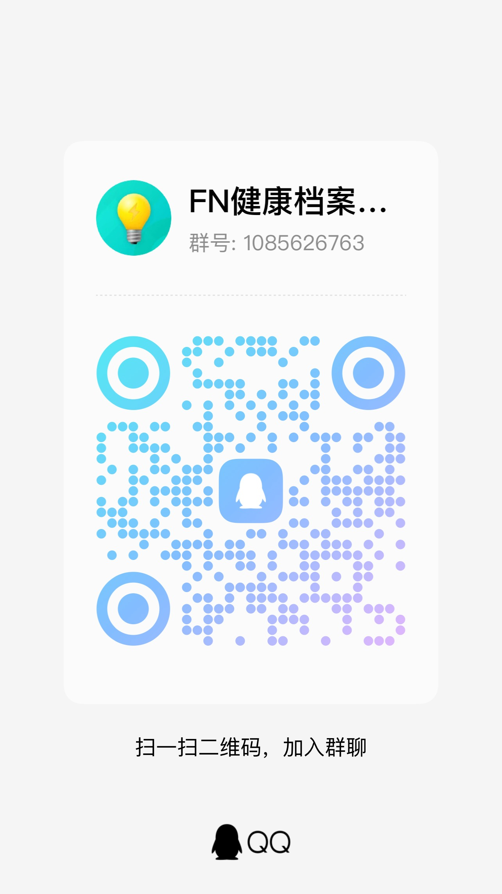

# 健康档案

健康档案是一款运行在 fnOS 上的家庭医疗报告归档应用。应用支持拍照、多图和 PDF 上传，通过本地 OCR 与可选 AI 生成结构化记录，保留报告原件、PDF 单页高清图和字段证据，并按医院报告生成日期形成家庭成员健康时间轴。

当前版本已经具备核心档案闭环：概览、档案时间轴、上传处理进度、OCR 文本质量提示、AI 整理、报告校对、定量/定性指标趋势、独立形态发现、提醒、重复报告检测、回收站、完整备份/校验/恢复、运行状态、AI 配置与审计。完整功能进度见 [健康档案应用-TODO.md](./健康档案应用-TODO.md)。

应用发布流程见 [应用发布与数据库升级流程](./docs/RELEASE_PROCESS.md)，Docker 安装见 [Docker 部署](./docs/DOCKER_DEPLOYMENT.md)，版本升级、本地 SQLite 按需迁移和提交检查流程见 [版本与数据库迁移规范](./docs/VERSION_MIGRATION.md)。

## 应用定位

健康档案面向家庭长期健康资料管理，重点解决“报告保存了但很难用”的问题。体检报告、门诊检查、住院记录、检验单和 PDF 电子报告经常分散在医院公众号、手机相册、聊天记录、电脑文件夹和网盘里；真正复诊或回看指标时，很难快速找到同一成员、同一时间、同一项目的完整资料。

应用不会替代医生诊断，也不会根据报告生成疾病判断。它的目标是把原始报告可靠保存下来，并通过 OCR、AI 整理、时间轴、趋势和提醒降低家庭健康资料的整理成本：

- 报告原件留存在 NAS 应用私有目录，方便长期保存和备份。
- AI 负责辅助提取医院、日期、科室、部位、结论、建议、趋势指标和形态发现，最终仍以原报告为依据。
- 按报告生成日期归档，而不是按上传时间堆叠，适合补录多年历史报告。
- 指标趋势支持反向定位来源报告和单页高清图，便于核对原始依据。
- 多成员档案适合为父母、子女集中整理体检、检查、复查和住院资料。

## 典型场景

- **年度体检归档**：上传体检 PDF 或多张报告图片，AI 整理体检结论、异常项目、指标和复查建议，并按报告日期进入时间轴。
- **陪老人复诊**：按家庭成员快速查找历史 CT、超声、检验、住院记录和出院小结，必要时直接打开原件或单页高清图给医生查看。
- **儿童健康资料**：集中保存孩子的门诊检查、疫苗记录、口腔检查和住院单据，避免资料散在多个账号或设备里。
- **指标长期对比**：对血脂、血糖、尿酸、血红蛋白、BMI 等定量/定性指标做名称和单位归一化，按常见体检目录分组，并优先呈现报告已标异常或接近参考边界的项目。
- **影像和超声整理**：将囊肿、结节、斑块、息肉、结石、积液、器官形态、回声、血流和原报告分级整理为独立形态发现，保留尺寸、侧别、原文和页码证据，不与检验数值混入同一趋势。
- **形态变化追踪**：在趋势区切换到“形态变化”，按成员、器官、侧别、区域和发现类型保守关联历次记录，查看原报告尺寸、状态、分级或描述差异，并直接回到来源报告和单页高清图。信息不足或存在多病灶歧义时保留为待确认，可人工关联、拆分、合并或标记为误提取，也可从变化线创建复查提醒。
- **复查事项提醒**：把报告中明确出现的复查要求整理为待确认提醒，减少“看完报告就忘”的情况。
- **重复报告清理**：基于报告内容而非单纯文件 hash 检测疑似重复，适合处理同一报告多次拍照或 PDF/图片重复上传的情况。

## 界面预览

截图位于 [snapshot/](./snapshot/)，包含 PC 与触屏端核心页面。仓库中的截图使用模拟数据生成，仅用于展示界面和功能流程。

### PC 端


概览页集中展示报告总数、已归档数量、待识别数量、待处理提醒、最近报告和待识别报告，适合作为家庭健康资料的入口工作台。


档案页采用左侧时间轴、右侧报告详情的分栏结构。报告按医院生成日期排序，详情中可以查看基础字段、AI 整理结果、OCR、处理进度、原件和校对入口。


趋势页按一般检查、内外科、检验、功能和影像等常见体检目录展示归一化指标，并提供“需要关注”和按用户隔离的“我的关注”。搜索只匹配标准名称和可信字典别名，趋势点可回到来源报告和原图。


上传页支持图片、多图、拍照和多页 PDF。多张图片或 PDF 页面可以作为同一份报告进入识别流程，上传后后台任务会继续处理。


提醒页同时承载手工提醒、报告复查建议和任务完成/失败通知，支持到期、逾期、已读等状态管理。


AI 审计页面向管理员，展示 AI 调用次数、成功失败、耗时、Token 消耗和模型信息，便于排查识别效果和调用成本。

### 触屏端


触屏端保留相同的信息结构，底部导航适配手机和飞牛 App WebView，适合随手拍照、查看最近报告和处理提醒。


触屏端点击报告会在当前页面打开详情抽屉，不跳转到列表页外，方便在移动端连续查看字段、OCR 和 AI 整理内容。


查看指标来源时会打开当前页看图模式，支持单页高清图、缩放、翻页、下载和进入全屏查看。

## 技术架构

- Vue 3、Vue Router、Vite
- Nitro 3、Node.js 22
- Node.js 内置 SQLite、WAL、版本化迁移
- RapidOCR/OpenVINO、PyMuPDF
- OpenAI-compatible 文本与视觉模型接口，内置 DeepSeek、Kimi、GLM、Qwen、OpenAI 和豆包配置模板

AI 调用按运行时、任务路由和领域实现分层；Provider 凭据统一保存，各 AI 场景可继承默认模型或独立绑定 Provider/模型。扩展约束见 [AI 能力架构](./docs/AI_ARCHITECTURE.md)。
- fnOS Unix Socket 统一网关与系统账号身份
- 安装时可配置服务端口，默认 3334

## 主要功能

- 家庭成员档案：支持默认本人、家庭成员新增维护，以及 fnOS 管理员对成员访问权限的管理。
- 报告上传：支持拍照、多图、拖放、HEIC、JPEG、PNG、WebP 和多页 PDF；上传后可离开页面，后台任务继续处理。
- OCR 与 PDF：PDF 可拆分为单页记录；遇到原生文字层不完整、页面包含大面积扫描图或表格图片时，会按页高清渲染后 OCR，并与 PDF 文字层合并；OCR 结果记录质量分数、弱识别原因和详细处理日志；单页预览使用高清图，原 PDF 可单独查看。
- AI 结构化：管理员可配置 OpenAI-compatible 多模型 Provider；模型切换保留各自配置，API Key 加密存储；AI 输出报告标题、类型、医院、科室、部位、日期、结论、建议、定量/定性指标和形态发现。系统会在设备内预判体检、检验、影像、门诊、住院、处方、票据和疫苗等内容类型，再为每个解析单元组合专属提取约束；诊断、用药、诊疗操作、接种和费用分别保存，体检总结、检验标本/方法、病理镜下所见、门诊病史、住院经过等原文章节也使用固定类型独立保存，不混入趋势指标。进入 AI 前会按 OCR 原始顺序重建页面并过滤患者直接个资，再按完整页面、章节和表格边界生成稳定解析单元。
- 形态发现：影像、超声、内镜、病理和体格检查中的结构变化独立存入 `morphology_findings`，记录器官、区域、侧别、类型、尺寸、扩展测量、形态描述、原报告分级、原文证据和置信度。系统会在本地建立跨报告形态变化线，左右侧冲突不合并，多区域歧义保留待确认；成员管理员可校对字段、人工关联/拆分/合并、忽略误提取并创建复查提醒，人工结果在 AI 重跑和维护重建后仍保持优先。
- 报告详情：支持处理进度折叠、任务详细日志、失败重试、查看 OCR、查看原件、全屏看图、校对字段、手动触发 AI 整理、重新 OCR+AI、确认归档和移入回收站；诊断、用药、诊疗操作、疫苗、费用和报告类型专属原文章节可以逐项增删改，人工结果在 AI 重跑后保持，并可从证据直接打开对应高清原页。
- 档案时间轴：按医院报告生成日期排序，首次加载 20 条，滚动到底部自动游标分页；搜索和成员切换会重置分页。
- 趋势与来源：所有机构共用同一套核心与远程指标字典，系统结合标准名称、英文代码、单位和报告上下文归一化常见体检指标；百分比与绝对值、空腹与餐后等不同医学含义不会合并。未命中字典的名称进入管理员问题池，不会由 AI 自动创建标准指标；维护者补充远程字典后，设备可独立更新字典并在本地回填历史数据。页面按常见体检科室与检验子分组稳定排序，提供“需要关注”“我的关注”、标准分组筛选和可信别名搜索；指标说明只解释用途，不给出诊断、风险预测或用药建议。指标点可反向打开来源报告和对应单页高清图。
- 提醒和通知：支持手工提醒、报告复查建议生成提醒、处理完成/失败通知、已读归档和“我的”入口徽标。
- 重复报告：OCR 完成后会先在设备内比较原件指纹、医疗编号、去噪文本和带结果的数据行，高度重复时暂缓自动 AI 以减少无效调用；AI 整理后的字段和指标继续作为补充判断，支持查看详情、合并原件页或移入回收站。
- 数据安全：报告删除先进入 30 天回收站，可恢复或永久删除；完整备份包含数据库、原件、缩略图、配置和 AI 密钥，内置 sha256 文件校验清单，支持下载、校验、上传外部备份恢复和删除备份记录。
- 运维审计：运行状态展示数据库、存储和任务队列；用户操作日志、AI 调用次数、耗时、Token 和失败状态支持分页查看；管理员可查看脱敏后的系统运行日志、日志占用和轮转策略，手动清理运行日志或导出诊断包。

## Docker 部署

Docker 版本使用独立本地管理员登录，数据持久化在 `fnos-health-records-data` 卷；fnOS 安装包仍使用系统网关账号。首次启动前创建密码 Secret：

```bash
mkdir -p secrets
umask 077
printf '%s\n' '替换为至少12位的强密码' > secrets/local_admin_password.txt
docker compose pull
docker compose up -d
```

默认访问 `http://服务器地址:3334/`，用户名为 `admin`。正式环境建议固定 `HEALTH_RECORDS_VERSION` 并通过 HTTPS 反向代理访问。完整安装、升级、回滚、卷备份、OCR 和代理配置见 [Docker 部署文档](./docs/DOCKER_DEPLOYMENT.md)。

本地管理员可在应用内修改密码；忘记密码时可在停止容器后使用镜像内置的离线重置命令，过程不会影响 fnOS 网关账号。

## 本地开发

```bash
npm ci
npm run dev
```

默认地址：

```text
应用：http://127.0.0.1:3334/app/fnos-app-health-records/
Vite：http://127.0.0.1:3335/app/fnos-app-health-records/
```

端口被占用时可以覆盖：

```bash
APP_PORT=3350 WEB_PORT=3351 npm run dev
```

测试与构建：

```bash
npm test
npm run dictionary:validate
npm run dictionary:manifest
npm run build
npm run pack:app
npm run pack:fpk
npm run release:notes
npm run release:ci
```

版本号统一由 `package.json` 管理，发布前使用：

```bash
npm run version:bump
npm run version:auto
npm run version:bump -- --yes
npm run version:bump -- patch
npm run version:bump -- minor
npm run version:bump -- 0.2.0
npm run version:bump -- patch --dry-run
pnpm version:bump
pnpm version:auto
pnpm version:bump --yes
pnpm version:bump minor
pnpm version:bump 0.2.0
pnpm version:bump --dry-run
pnpm version:auto --dry-run
```

本地发布使用：

```bash
pnpm release
```

该命令会要求工作区干净，交互选择版本，执行完整构建校验，创建版本提交和 `v版本号` tag。GitHub Actions 只使用 `release:ci` 基于已推送的 tag 构建产物，不修改版本、不打 tag。

GitHub Release 正文由 `npm run release:notes` 生成，会读取 `CHANGELOG.md` 当前版本段落作为“本版本变更”，并补充 `template.config.json` 的发布摘要/亮点、应用 ID 和目标数据库 schema。发布前建议先本地执行一次预览。

## 目录

```text
packages/ui/                 Vue 页面、布局、组件和领域类型
packages/server/database/    SQLite Schema、迁移和连接
packages/server/domain/      健康报告与身份类型
packages/server/services/    报告、认证、OCR 和 AI 服务
packages/server/routes/api/  Nitro API
packages/ocr-worker/         OCR 与 PDF 处理 Worker
packages/assets/             fnOS 应用图标
dictionary/                  内置及远程指标字典、分类和 JSON Schema
scripts/                     开发、生命周期、构建和打包脚本
```

指标字典的字段、分层、版本约束和发布命令见
[dictionary/README.md](./dictionary/README.md)。核心字典随应用发布；远程字典是完整快照，
通过独立 GitHub Pages 工作流发布，不要求升级应用版本。管理员可在“我的 → 维护工具 →
指标字典”检查并安装更新、查看校验失败历史或回滚历史快照；应用启动会将当前核心和远程
快照物化到 SQLite，字典 revision 变化后的历史指标重匹配只在本地执行，不调用 AI。
未命中的定量/定性项目名称会持久化进入“指标问题池”，重复整理不会重复计数。当前
`taxonomy.json` 和 `indicators.json` 只维护进入趋势的 `quantitative`、`categorical`
指标；形态发现不进入远程指标字典，后续如需标准化器官、病灶和分级体系，将使用独立
形态字典，避免与趋势指标的单位、参考范围和别名规则混用。
管理员可以在问题池批量选择名称并打开预填的 GitHub Issue；外发内容仅包含指标名称，
不包含医院、报告、结果值、成员或其他健康数据。维护者运行 `npm run dictionary:release`
发布远程字典后，设备无需升级应用即可安装并回填历史指标。

fnOS 包根目录 `ICON.PNG` 使用 512×512 图标，供应用中心/应用详情页大图展示；桌面入口继续使用 `app/ui/images/icon_{size}.png` 多尺寸图标。

## 数据目录

开发环境使用 `.data/`，fnOS 安装环境使用 `TRIM_PKGVAR/data/`：

```text
db/            SQLite 数据库
reports/       健康报告原件
thumbnails/    页面缩略图
models/        OCR 模型
backups/       备份文件
secrets/       AI 密钥
config/        安装向导生成的运行配置
ocr-venv/      OCR Python 虚拟环境
```

管理员可在“我的 → 备份与恢复”创建完整应用备份。完整备份位于 `backups/full/`，格式为 `.tar.gz`，包含 SQLite 一致性快照、报告原件、分页/缩略图、运行配置和 AI 密钥；备份清单内记录文件大小和 sha256，可在页面中手动校验。恢复支持选择已有备份或上传外部备份包，恢复前会自动额外创建一份“恢复前安全备份”；恢复完成后建议刷新页面或重新打开应用确认数据状态。备份包包含医疗数据和密钥，请仅保存在可信设备。

应用运行日志位于 `TRIM_PKGVAR/log/app.log`，包含服务端异常、失败接口、OCR/任务异常和前端未捕获异常的脱敏摘要。日志在写入磁盘前会递归隐藏 API Key、认证信息、密码、手机号、身份证号、邮箱、设备路径和可能包含报告正文的字段，页面读取时仍会再次脱敏以兼容旧日志。默认单文件达到 `5 MB` 后自动轮转，最多保留 `5` 个归档文件；可通过 `APP_LOG_MAX_BYTES` 和 `APP_LOG_MAX_FILES` 调整。

fnOS 系统管理员可在“我的 → 系统日志”查看占用和保留上限、清理应用运行日志，或导出一次性 `.tar.gz` 诊断包。诊断包包含脱敏后的应用运行日志、OCR 安装日志、fnOS 启停日志和运行环境摘要；每个日志文件最多截取末尾 `2 MB`，不包含数据库、报告原件、OCR 报告内容、AI 配置与密钥或用户身份资料。临时诊断包在下载流结束后立即删除，清理和导出操作都会写入用户操作审计。

开发环境默认额外启用独立的 AI 入参调试日志：

```text
.data/logs/ai-input-debug.log
```

它在 AI 请求发出前记录实际请求体，包括模型、系统提示词和经过患者直接个资过滤的 OCR 文本，便于核对最终提交内容；不会记录 API Key、Authorization 或 AI 响应正文，也不会加入系统日志中心和诊断包。生产环境默认关闭，可通过 `AI_INPUT_DEBUG_LOG=1` 临时开启；开发环境可通过 `AI_INPUT_DEBUG_LOG=0` 关闭。单文件默认上限为 `10 MB`，保留 2 个轮转文件，可使用 `AI_INPUT_DEBUG_LOG_MAX_BYTES` 和 `AI_INPUT_DEBUG_LOG_MAX_FILES` 调整。

该调试日志仍包含检查结果、指标和报告结论等健康信息，仅应保留在可信设备本地。排查结束后应删除，不应直接上传到 Issue、论坛或其他公共位置。

## fnOS 访问方式

- 桌面入口通过 `/app/fnos-app-health-records` 和 Unix Socket 复用 fnOS 登录态。
- 安装/配置向导只设置服务端口，默认 `3334`。
- 账号体系完全使用 fnOS 提供的用户身份，fnOS 系统管理员即应用管理员。
- 非 fnOS 网关请求不会信任外部提供的 `X-Trim-*` 头，也不提供独立账号登录。

## OCR 安装失败排查

OCR 环境不会随应用包内置完整 Python 虚拟环境，首次使用前需要管理员在“我的 → 运行与识别”中安装。安装过程会在设备本地创建 `ocr-venv`，并下载 RapidOCR、PyMuPDF、Pillow 等 Python 依赖。安装完成后会加载 OCR 引擎，生成一张本地测试图片并执行 OCR 识别；只有测试通过后才会写入就绪标记并显示为可用。

默认策略会先检查设备现有环境，不覆盖系统 Python：

1. 已安装的应用私有 Python 3.11。
2. 系统 Python 3.11、3.10、3.9，优先使用 OpenVINO 后端。
3. 如果没有 3.9–3.11，会尝试安装应用私有 Python 3.11 到应用数据目录。
4. 如果没有配置私有 Python 安装包，最后才回退到系统 Python 3.12，并使用 ONNXRuntime 兼容后端。

OpenVINO 依赖安装或动态库加载失败时会自动切换到 ONNXRuntime 备用后端。Python 3.12 环境会直接使用 ONNXRuntime，因为当前锁定的 OpenVINO 版本范围没有 Python 3.12 可用 wheel。

应用私有 Python 不会写入 `/usr/bin`、`/usr/local/bin` 等系统路径，默认安装在：

```text
/var/apps/fnos-app-health-records/var/data/runtime/python-3.11
```

可通过以下方式提供应用私有 Python 包：

- 包内预置：`ocr-worker/python-runtimes/python-3.11-linux-x86_64.tar.gz`。
- 环境变量指定本地包：`OCR_PRIVATE_PYTHON_ARCHIVE=/path/to/python-3.11.tar.gz`。
- 环境变量指定下载地址：`OCR_PRIVATE_PYTHON_URL=https://.../python-3.11.tar.gz`。

如果安装失败，可以在“运行与识别 → OCR 安装诊断”查看：

- 当前运行环境的 Python、OCR 后端、识别模型、PyMuPDF、Pillow 和 HEIF 支持版本。
- 安装失败时的错误、告警和缺失路径。
- 最近安装日志尾部。
- 完整日志文件路径：`/var/apps/fnos-app-health-records/var/log/ocr-install.log`。

Python 3.12 使用 ONNXRuntime 后端时，首次安装会下载 rapidocr、onnxruntime、opencv、numpy、PyMuPDF、Pillow 等多个 wheel。低速网络下可能需要 10–30 分钟；安装期间服务端会每 30 秒写入一条心跳日志，看到 `still running` 不代表卡死。pip 版本满足要求时会跳过升级，减少慢网下载耗时；如需强制升级可设置 `OCR_UPGRADE_PIP=1`。

### PDF 清晰但 OCR 缺内容

有些医院 PDF 看起来很清晰，但内部可能只有一部分文字层，检查表格、图片化页面、盖章区域或扫描块并不能被 `PDF 文字提取`完整拿到。应用会按页判断文字层行数、文本量和图片覆盖面积：文字层可靠时直接使用 PDF 文字；文字层疑似不完整时，会把当前页以高清图片渲染后再做 OCR，并把 OCR-only 内容合并回文字层。报告详情的“处理进度 → 详细日志”会展示本页来源，例如“PDF 文字层+高清 OCR 合并”、渲染倍数和合并行数。

默认 PDF OCR 渲染倍数为 `3x`，可通过环境变量 `OCR_PDF_RENDER_SCALE` 调整，允许范围为 `2–4`。倍数越高，小字和密集表格越容易识别，但 CPU、内存和耗时也会增加。

常见失败原因：

- 设备上没有可用的 Python 3.9–3.12。
- Python 安装缺少 `venv` 或 `pip`。
- 设备无法访问 PyPI，或需要配置可用的 pip 镜像。
- 未配置应用私有 Python 包，且设备上只有 Python 3.12 时，会自动回退 ONNXRuntime，不会继续强装 OpenVINO。
- 当前 CPU 架构或 Python 版本没有 rapidocr-openvino/openvino 对应 wheel；应用会尽量自动切换到 ONNXRuntime 后端。
- 数据目录不可写或磁盘空间不足。
- macOS arm64 仅作为开发环境参考，OpenVINO macOS wheel 可能出现动态库加载兼容问题；fnOS OCR 验收应以 Linux 真机日志为准。

报告原件会先安全保存；OCR 安装成功后，可在报告详情中重试失败任务或重新执行 OCR+AI。

## 隐私边界

原件默认保存在 NAS 应用私有目录。AI 默认只接收 OCR 文本；进入 AI 前过滤患者姓名、证件号、电话、地址、邮箱和精确出生日期，保留性别、报告明确年龄以及报告号、门诊号、住院号、体检号、检查号、标本号和条码号等业务编号。本地报告 ID、成员 ID、用户 ID、文件路径和原文件名不会加入 AI 输入。只有 fnOS 系统管理员显式启用视觉增强后才允许发送完成个资遮挡的页面副本。

## AI 输入规划

OCR 完成后，服务端先根据页码和识别坐标恢复阅读顺序、合并同一视觉行，再重建不带逐行内部编号的扁平纯文本。脱敏后会删除页码、打印声明、纯个资占位符和低置信短噪声；跨页重复内容只清理页面首尾区域的短页眉页脚，原始 OCR 始终保留。重建行会进一步标记为元数据、表头、章节、定量/定性指标、形态发现、叙事正文、噪声或待判断内容。

表头列关系明确、指标字典唯一命中且 OCR 置信度可靠的表格行直接在设备内形成高可信指标，不再重复交给 AI。其余内容分成文档概况、指标、形态和叙事四种最小路由：文档概况优先汇集总检/出院/病理结论、元数据、章节目录和首页标题；指标路由只发送尚未本地确认的数据行及必要表头；形态路由只发送形态候选；叙事路由保存住院经过、出院医嘱、门诊病史和病理所见等原文章节。没有指标候选的医疗正文不会被跳过。

常规指标和形态单元按完整页边界贪心装箱，每个单元最多 6 页、目标不超过 8,000 字符、预估 7,000 输出 Token 且最多包含 60 个待 AI 判断的数据行；单页自身超限时仍作为一个完整单元发送，不会从页面中间拆断表格、章节或原报告上下文。未超限的单页报告会合并文档概况和指标提取，避免无意义地增加调用。

每个解析单元都有稳定的 `unitKey` 和输入 SHA-256，整份报告另有 `planHash`。系统默认最多并发调用 3 个单元，并将状态、结果、Token、耗时和每次真实尝试持久化到 SQLite；应用或父任务重试时，输入哈希一致的已完成单元会直接复用。全部主单元成功后，服务端按 OCR 来源合并重复指标，再汇总公共字段、定量/定性指标、形态发现、临床事实和报告专属章节，并在一个事务内替换旧 AI 结果，处理中途不会写入半份结果。

提示词按当前路由动态组合最小公共规则和最小输出契约，不再让检验单元携带处方、票据、疫苗和形态发现等无关 Schema，也不会在 OCR 正文后重复追加一遍候选原文。指标响应继续使用省略空值的紧凑字段，AI 只返回原始项目名、结果、明确单位、参考范围、异常标记和最短定位证据，标准指标名由本地核心/远程字典统一。

如 Provider 的并发配额较低，可通过 `AI_EXTRACTION_CONCURRENCY=1` 或 `2` 降低并发；默认值和允许的最高值均为 `3`，防止单份长报告瞬间占满模型接口配额。

AI 返回无效 JSON 时只对当前单元进行一次严格格式重试。合并后，服务端会从 OCR 明确内容中确定性补齐身高、体重、BMI、腰围、臀围、脉搏和血压；其他可信但未匹配的数据行只按页补提取一次，仍无法确认时保留待核对数量，不让整份报告反复失败。开发诊断可通过 `GET /api/reports/:id/ai-plan` 查看有权限报告的脱敏切割计划。

开源仓库：[https://github.com/timor-m/fnos-app-health-records](https://github.com/timor-m/fnos-app-health-records)

项目基于 [fnos-app-template](https://github.com/timor-m/fnos-app-template) 初始化。

## 交流群

使用问题、功能建议和指标字典反馈都可以在 QQ 群里讨论，群号：1085626763。


