# [应用分享] 健康档案：把家人的体检、检查、住院报告都整理成一条时间轴

大家好，我最近在做一款适配 fnOS 的家庭健康报告管理应用：**健康档案**。

它想解决的其实是一个很日常、但很烦的问题：体检报告、门诊检查单、住院记录、检验报告、PDF 电子报告……这些东西平时都散落在微信、相册、文件夹、医院小程序里。等真要回看时，经常想不起“去年在哪家医院查过”“那次尿酸是多少”“医生说多久复查来着”。

所以我做了这个应用：把报告随手上传到 NAS，应用自动 OCR + AI 整理，最后按医院报告日期生成家庭成员的健康时间轴。

开源仓库：[https://github.com/timor-m/fnos-app-health-records](https://github.com/timor-m/fnos-app-health-records)

当前版本：`0.2.4`

## 为什么需要这样一个应用？

很多家庭其实不是没有健康资料，而是资料一直处在“看似保存了，实际很难用”的状态。

比如：

- 体检报告在医院公众号里，过一段时间入口变了，登录还要验证码
- PDF 下载到电脑，照片又在手机相册，家里老人孩子的报告混在一起
- 医生问“以前有没有查过这个指标”，临时翻半天也找不到
- 每年体检都有血脂、尿酸、血糖，但想看趋势只能手动翻报告
- 报告里写了“三个月后复查”，当时记得，过几天就忘了
- 同一份报告拍照、截图、PDF 各存了一份，最后不知道哪个是完整版本
- 给父母、孩子整理报告时，很难区分是谁的、哪一年、哪家医院

健康资料不像普通文件。它有几个特点：

- **周期长**：很多指标需要看几年变化，而不是只看一次结果
- **格式乱**：不同医院、体检机构、年份的版式都不一样
- **来源散**：照片、PDF、公众号截图、电子报告混在一起
- **回看频率低但关键时刻很重要**：平时不看，真去医院时又很需要
- **隐私敏感**：不太适合到处上传、转发和存在公共云盘里

所以这类资料很适合放在自己的 NAS 上，由应用帮忙做“归档、识别、索引、趋势和提醒”。

## 它适合谁？

- 家里有老人、孩子，需要长期保存体检/检查资料
- 每年都会做体检，希望能对比历年指标变化
- 报告 PDF、照片太多，想集中放在自己的 NAS 里
- 不想每次翻医院小程序、聊天记录、相册找报告
- 希望 AI 先帮忙把报告内容整理出来，再自己确认归档
- 经常需要帮父母、孩子管理检查单、复查单和住院记录
- 希望医疗资料尽量留在自己的设备上，而不是长期散在多个平台

一句话：**不是替代医生，而是帮你把报告收好、看清楚、找得到。**

## 典型使用场景

### 场景一：每年体检后，顺手归档

体检中心一般会给 PDF 或图片报告。以前可能下载后随手丢到文件夹里，下一年再找就忘了在哪。

现在可以直接上传到健康档案，应用会自动识别报告日期、医院、科室、体检结论和指标。确认后，它会按报告生成日期进入时间轴。

后面想看“这几年血脂有没有越来越高”“尿酸是不是长期偏高”，就不用每年打开一份 PDF 慢慢翻。

### 场景二：带老人复诊时，快速找历史报告

陪父母去医院时，经常会遇到医生问：

- 上次检查是什么时候？
- 之前 CT 结论怎么写的？
- 这个指标以前高不高？
- 有没有住院记录或出院小结？

如果报告都存在健康档案里，可以按家庭成员切换，再按时间轴查看历史报告。需要看原始报告时，也可以直接打开原图或 PDF 单页高清图。

### 场景三：孩子的检查、疫苗、门诊资料集中保存

孩子的资料特别容易散：疫苗记录、口腔检查、门诊检查、发热就诊记录、住院单据等，很多都不是标准体检报告。

健康档案支持多成员，默认是本人，也可以添加家庭成员。父母可以把孩子的报告统一上传到孩子档案下，后面按时间查看会更清楚。

### 场景四：报告里有复查建议，不再靠脑子硬记

有些报告结论里会写“建议 3-6 个月复查”“建议结合临床随访”。这类信息以前很容易看完就忘。

应用会把明确的复查要求整理成待确认提醒，确认后进入提醒列表。到期、逾期都可以在应用里看到。

### 场景五：报告很多时，靠搜索和原图定位找依据

只看 AI 整理结果是不够的，关键还是要能回到原始报告。

健康档案会保留报告原件、OCR 文本和单页高清图。比如在趋势页看到某个指标异常，可以点回来源报告，直接打开对应页原图确认。

这点我觉得很重要：**AI 负责帮忙整理，但最终依据还是原报告。**

## 核心功能

### 1. 报告上传：照片、多图、PDF 都可以

支持拍照、多图上传、拖放上传，也支持多页 PDF。比如一份体检报告有很多页，可以一次上传为同一份报告。

应用会保存：

- 报告原件
- PDF 单页高清图
- 缩略图
- OCR 文本
- AI 整理后的结构化字段

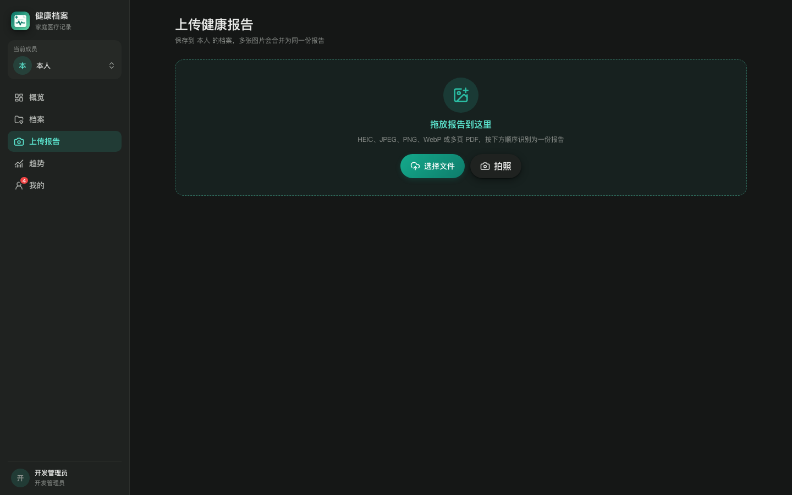

触屏端也专门做了适配，手机/平板上可以直接拍照上传。

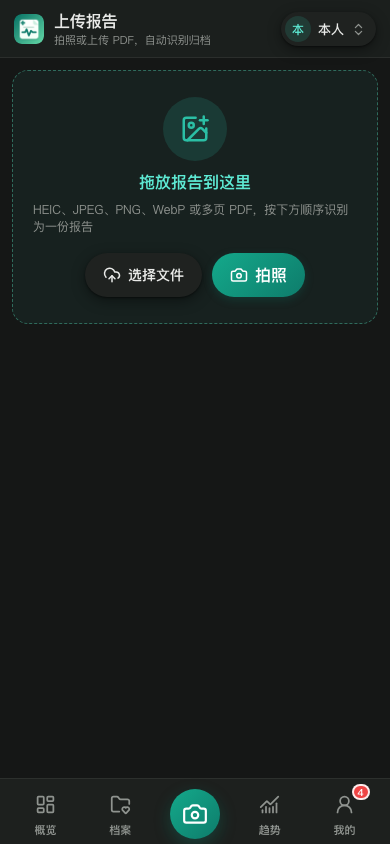

### 2. 自动 OCR + AI 整理

上传后会进入后台任务，不需要一直停留在上传页面。

应用会尝试识别并整理：

- 报告标题
- 医院/院区
- 科室
- 检查部位
- 报告类型
- 报告日期
- 检查所见
- 结论
- 建议/复查要求
- 检验指标和异常标记

整理完成后可以人工校对，再确认归档。

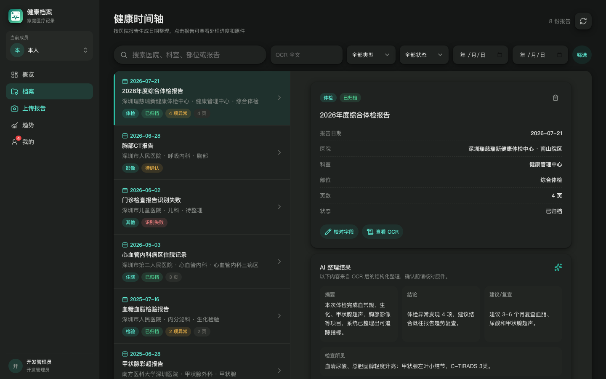

触屏端查看报告详情是当前页弹窗，不会跳走，适合在飞牛 App 里直接查看。

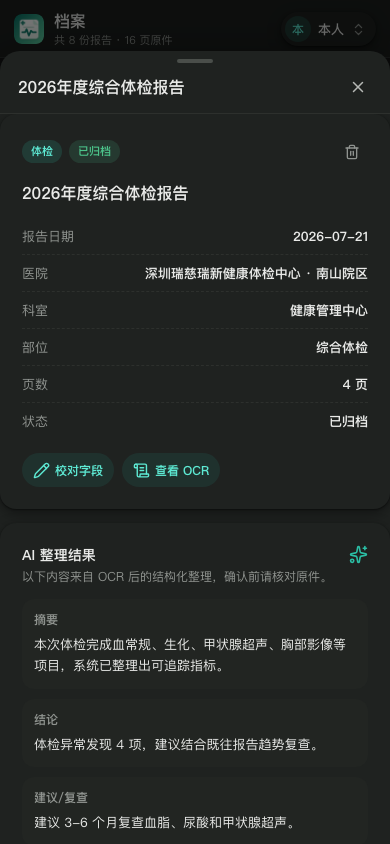

### 3. 健康时间轴：按报告生成日期排序

报告不是按上传时间排序，而是按医院报告生成日期排序。

比如今天补传 2023 年的体检报告，它会自动回到 2023 年的位置，不会挤到最新上传前面。

档案页支持：

- 当前成员报告数量
- 报告搜索
- OCR 全文搜索
- 类型/状态/日期筛选
- 滚动到底部自动加载更多
- PC 左侧时间轴 + 右侧详情
- 触屏列表 + 底部详情弹窗

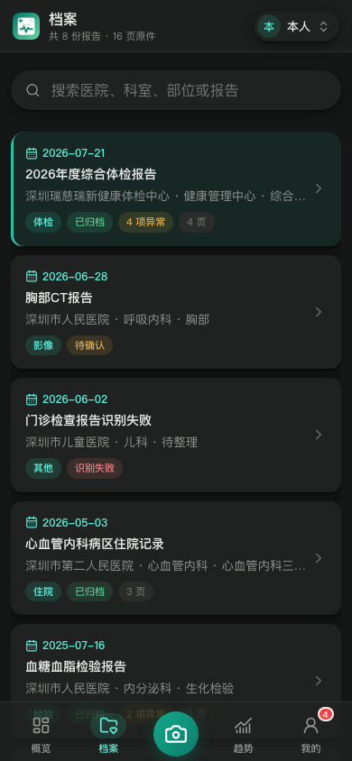

### 4. 指标趋势：从报告反向定位原图

对于常见检验/体检指标，应用会做归一化处理。

例如不同机构可能写：

- 血红蛋白
- HGB
- Hb

应用会尽量识别为同一类指标，并按年份/日期形成趋势。

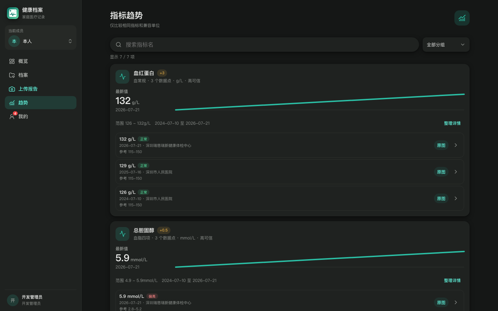

趋势点也支持反向定位到来源报告和对应单页高清图，方便回看原始报告，不用只相信整理结果。

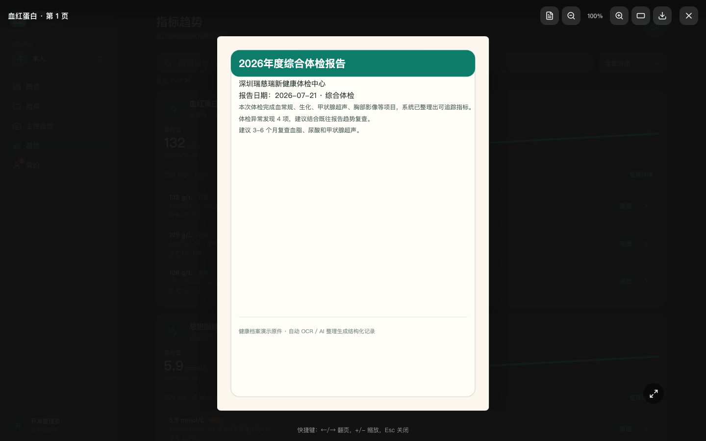

触屏端也可以查看趋势和原图。

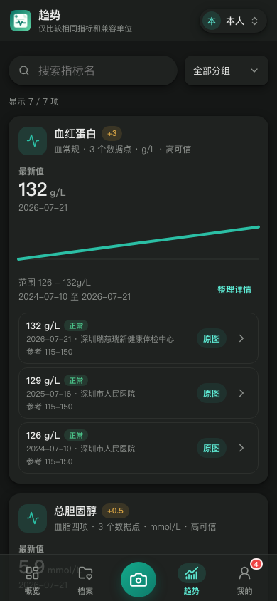

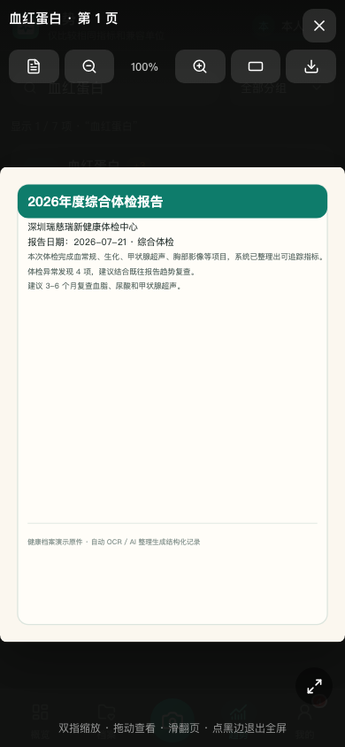

### 5. 概览页：快速看到最近情况

概览页会集中展示：

- 报告总数
- 已归档数量
- 待识别数量
- 待处理提醒
- 最近报告
- 待识别报告

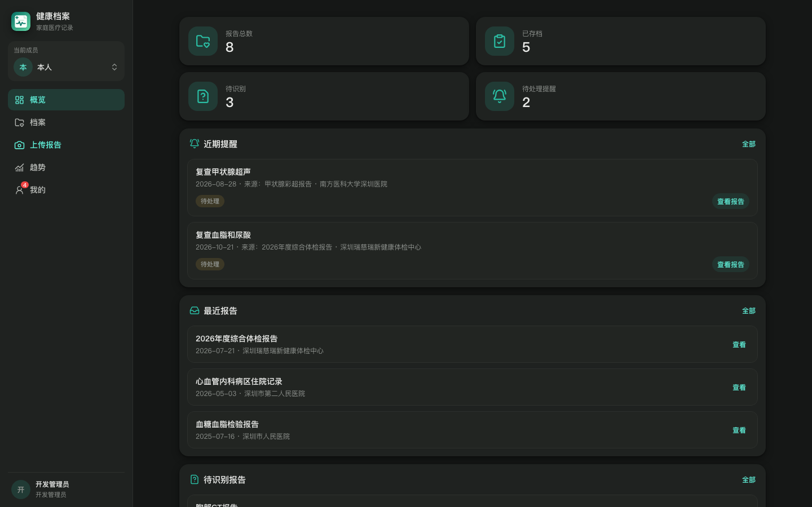

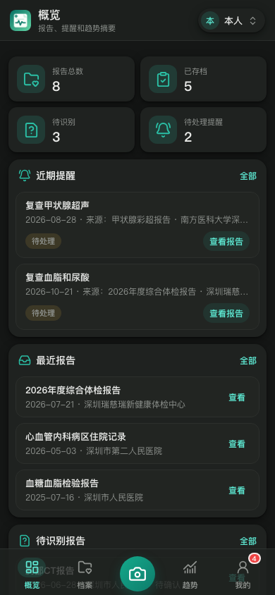

### 6. 提醒和通知

支持手动添加提醒，也支持从报告中明确出现的复查建议生成待确认提醒。

报告处理完成、失败等任务通知也会进入提醒入口。

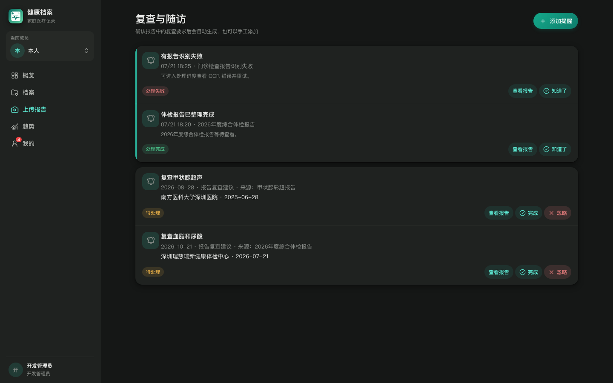

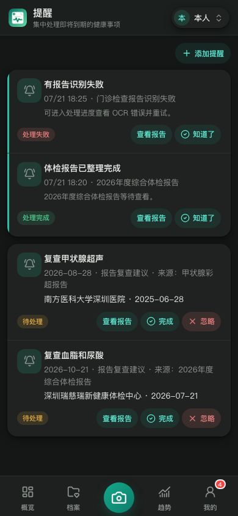

### 7. 重复报告检测

重复报告不是只看文件 hash。

因为同一份报告可能被拍了两次，图片文件肯定不一样；所以应用会结合 AI 提取出的报告内容来判断疑似重复，比如：

- 成员
- 医院
- 报告日期
- 报告类型
- 科室/部位
- 报告号/检查号
- 关键结论和指标

检测到后可以查看详情，再决定合并原件页或删除重复记录。

### 8. 备份与恢复

健康报告属于非常重要的数据，所以应用做了完整备份能力。

备份内容包括：

- SQLite 数据库
- 报告原件
- PDF 单页图
- 缩略图
- 运行配置
- AI 密钥文件
- sha256 校验清单

支持创建备份、下载备份、校验备份、上传外部备份恢复、删除备份记录。

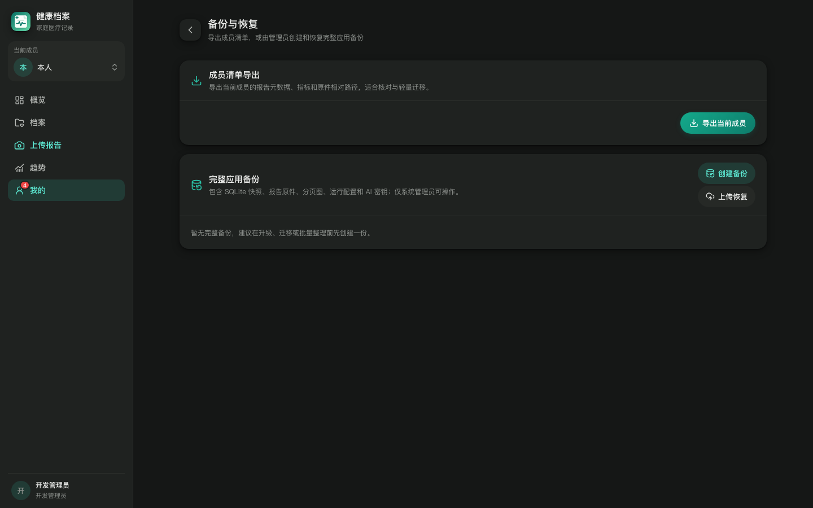

### 9. 管理员工具和审计

fnOS 系统管理员就是应用管理员。

管理员可以查看：

- 运行状态
- OCR 状态
- AI 配置
- AI 调用审计
- 用户操作日志
- 指标问题池
- 维护工具

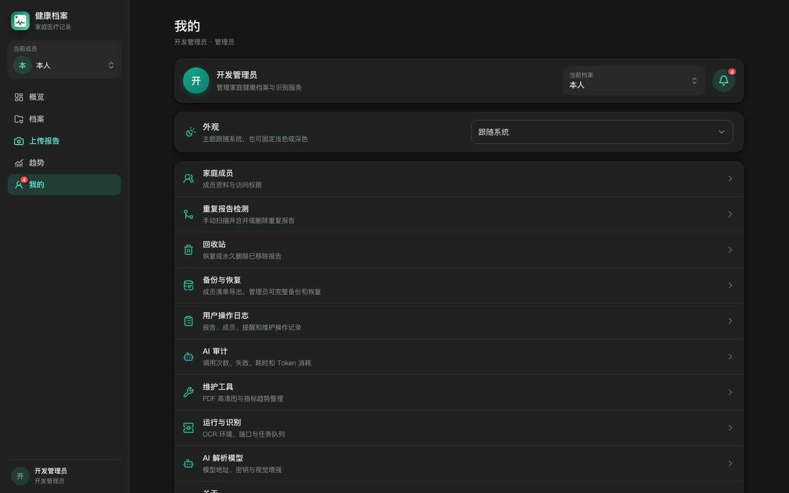

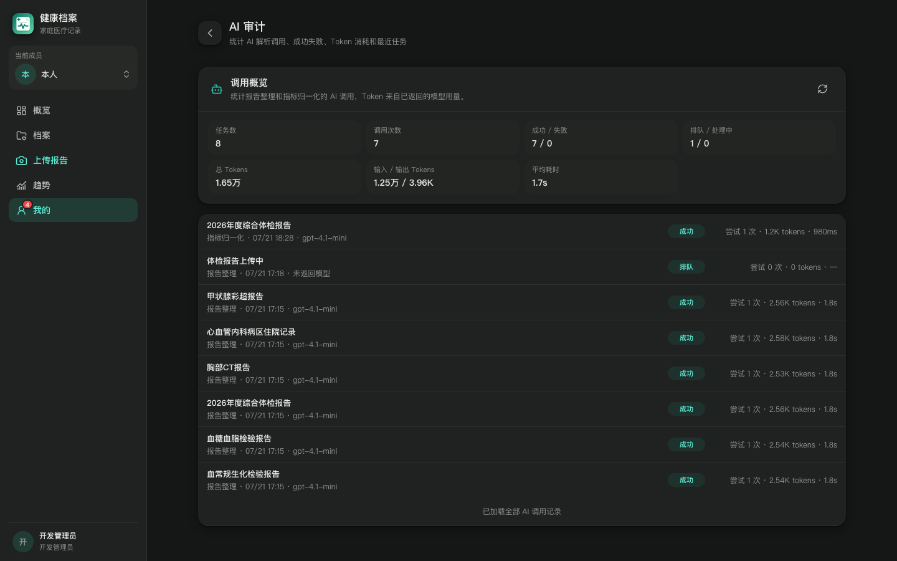

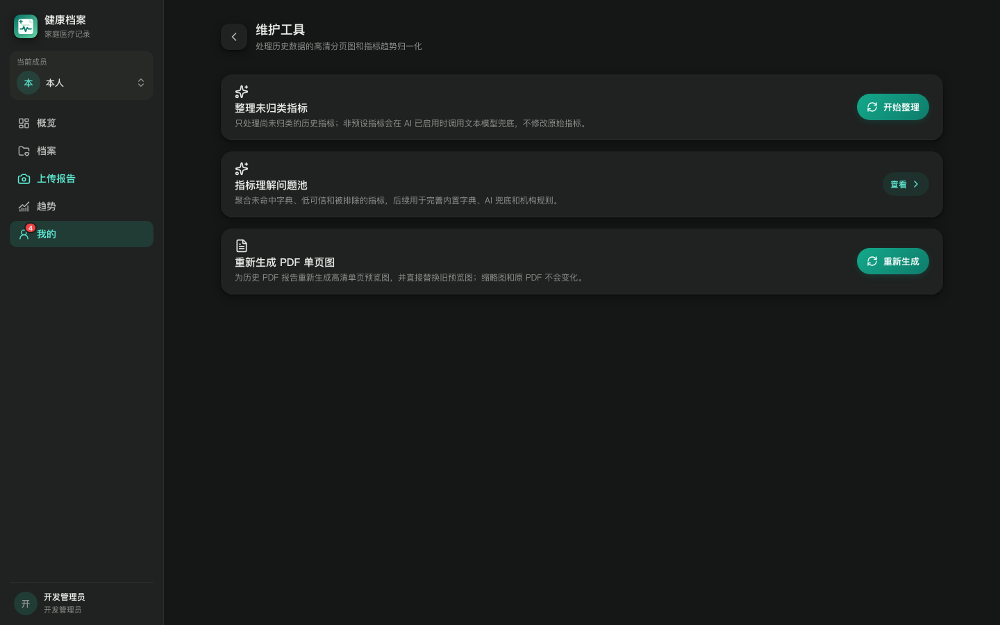

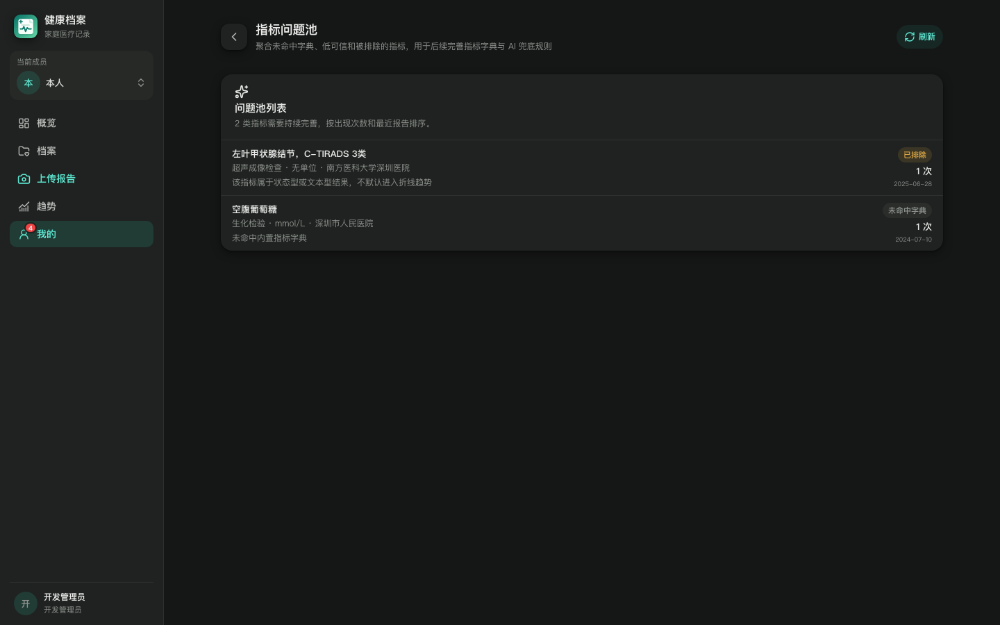

## 隐私和安全设计

这个应用的默认思路是：**报告原件优先保存在自己的 NAS 本地目录里。**

一些边界也做了限制：

- 账号体系使用 fnOS，不单独做一套账号密码
- fnOS 系统管理员即应用管理员
- AI 默认只使用 OCR 文本
- 视觉增强需要管理员主动配置
- API Key 加密存储
- 身份证、电话、住址不进入结构化字段、搜索索引、日志或 AI 摘要
- 删除报告会先进 30 天回收站
- 备份包包含医疗数据和密钥，建议只保存在可信设备

## 当前状态

目前应用已经具备比较完整的主流程：

- 上传报告
- OCR 识别
- AI 整理
- 人工校对
- 确认归档
- 时间轴查看
- 原图查看
- 指标趋势
- 提醒
- 重复检测
- 备份恢复
- 审计和维护

但它仍然是早期版本，医疗报告的格式差异非常大，尤其是不同医院、不同体检机构、不同年份的报告模板都不一样，所以后续还会继续优化：

- 更多指标字典
- 更稳的 AI 兜底归一化
- 更好的异常汇总展示
- 更多报告类型适配
- 更完善的移动端细节

## 安装和访问

应用默认服务端口：`3334`

安装时只需要配置服务端口，账号直接使用 fnOS 提供的身份体系。

访问路径：

```text
/app/fnos-app-health-records/
```

开源仓库：

[https://github.com/timor-m/fnos-app-health-records](https://github.com/timor-m/fnos-app-health-records)

## 最后

做这个应用的初衷很简单：家人的健康资料值得被好好保存。

很多报告我们平时看不太懂，但至少可以先做到：

- 不丢
- 找得到
- 能按时间看
- 能回看原图
- 能对比指标变化
- 能记住复查事项

如果你也有类似需求，欢迎试用、提 issue，或者一起完善更多医院/体检机构报告的识别效果。

也欢迎大家在评论里补充自己的使用场景和建议。

比如：

- 你平时是怎么保存体检报告的？
- 哪些报告类型最需要优先适配？
- 指标趋势还希望怎么看？
- 家庭成员、提醒、备份这些功能有没有更顺手的交互？
- 有没有适合 NAS 场景的健康资料管理方式？

如果你有自己的想法，也可以基于开源仓库二开。这个应用本身还在持续完善阶段，很多细节非常适合结合真实家庭场景一起打磨。
